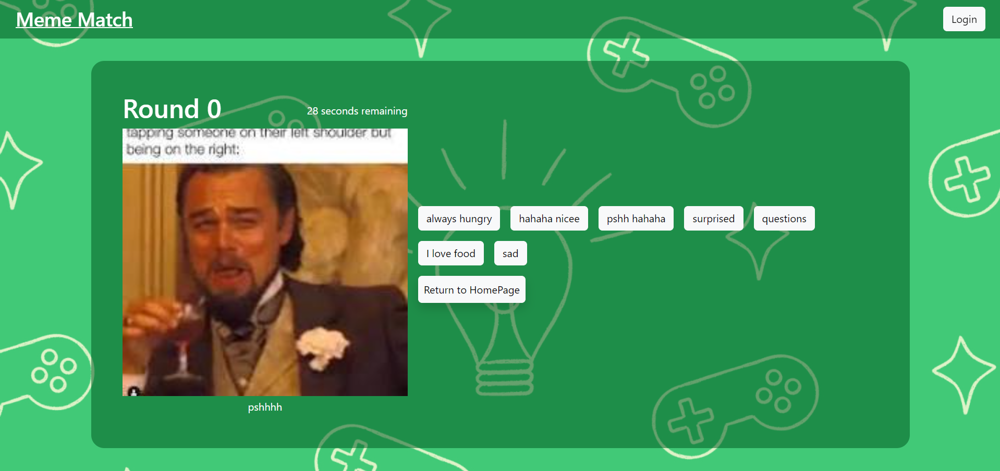
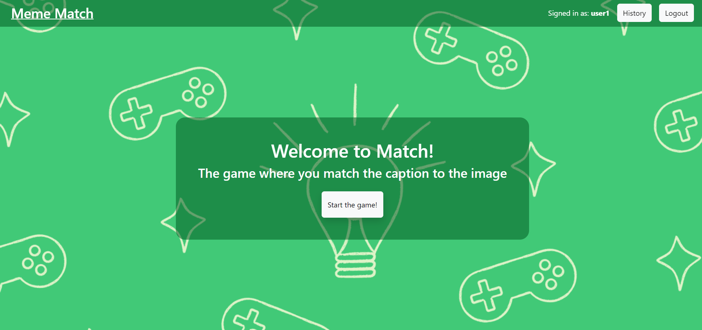
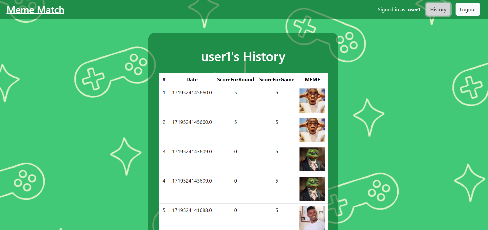

# Exam #N: "Exam Title"
## Student: s123456 LASTNAME FIRSTNAME 

## React Client Application Routes

- **Route `/`**: The home page of the application. It displays the main interface, which may include a list of items (memes), depending on whether `emptySelection` and `loggedIn` states are set. It's designed for all users, providing access to the `HomePage` component with props for `emptySelection`, `loggedIn`, and `matchItemList`.

- **Route `/match`**: A page for initiating a match. It's accessible to all users and leads to the `MatchPage` component with initial round set to `0`, a delay of `30` seconds, and props for `loggedIn`, `restartGame`, and `setRestartGame`.

- **Route `/game/round1`**: The first round of the game, accessible only if the user is logged in (`loggedIn && user`). It renders the `MatchPage` with props for `emptySelection`, `addSelection`, round set to `1`, and other game-related props. If not logged in, redirects to the home page `/`.

- **Route `/game/round2`**: The second round of the game, similar to `/game/round1` but for round `2`. It requires user authentication and provides a specific game setup through props.

- **Route `/game/round3`**: The third round of the game, following the same access and prop pattern as the previous game rounds, but for round `3`.

- **Route `/login`**: The login page, accessible to users who are not logged in (`!loggedIn`). It leads to the `LoginPage` with props for `login` and `loginaction`. If the user is already logged in, redirects to the home page `/`.

- **Route `/history`**: A page displaying the user's game history, accessible only to logged-in users (`loggedIn && user`). It renders the `HistoryPage` with the `user` prop. If not logged in, redirects to `/login`.

- **Route `/recap`**: A recap page, accessible to logged-in users, displaying the results of the game or other relevant information via the `Recappage` component with the `correctselection` prop. If not logged in, redirects to the home page `/`.

- **Route `*`**: A catch-all route for undefined paths, leading to a `NotFoundLayout` component, which likely displays a 404 or a custom "not found" message.

## Main React Components

- `ListOfSomething`
- `GreatButton` 
- `Container`

## API Server

### POST `/api/sessions`
- **Purpose**: Authenticates a user.
- **Request Parameters**: None.
- **Request Body Content**: `username` (string), `password` (string).
- **Response Body Content**: Authenticated user's information.
- **Response Status Codes and Possible Errors**: `200 OK` on success, `401 Unauthorized` for invalid credentials.

### GET `/api/sessions/current`
- **Purpose**: Checks the current user's session.
- **Request Parameters**: None.
- **Response Body Content**: Current authenticated user's information.
- **Response Status Codes and Possible Errors**: `200 OK` if authenticated, `401 Unauthorized` if not authenticated.

### DELETE `/api/sessions/current`
- **Purpose**: Logs out the current user by ending the session.
- **Request Parameters**: None.
- **Response Body Content**: Confirmation of session termination.
- **Response Status Codes and Possible Errors**: `200 OK` on successful logout, `400 Bad Request` if an error occurs.

### GET `/items/:isLoggedIn`
- **Purpose**: Retrieves a list of items based on login status.
- **Request Parameters**: `:isLoggedIn` (path parameter, `true` or `false`).
- **Response Body Content**: List of items.
- **Response Status Codes and Possible Errors**: `200 OK` on success, `400 Bad Request` if `:isLoggedIn` is not provided correctly.

### GET `/captions/:itemId`
- **Purpose**: Retrieves related captions for a specific item.
- **Request Parameters**: `:itemId` (path parameter, item ID).
- **Response Body Content**: Related captions.
- **Response Status Codes and Possible Errors**: `200 OK` on success, `404 Not Found` if item ID does not exist.

### GET `/captions/random/:captionIds`
- **Purpose**: Retrieves random captions excluding the specified IDs.
- **Request Parameters**: `:captionIds` (path parameter, comma-separated list of caption IDs to exclude).
- **Response Body Content**: Random captions not in the list.
- **Response Status Codes and Possible Errors**: `200 OK` on success, `400 Bad Request` if `:captionIds` is malformed.

### POST `/history/store`
- **Purpose**: Stores a game history record. Requires authentication.
- **Request Parameters**: None.
- **Request Body Content**: Object with `gameResult` (must be 0 or 5), `score` (integer between 0 and 5), `date` (date string), and `meme` (string).
- **Response Body Content**: Message indicating creation status.
- **Response Status Codes and Possible Errors**: `201 Created` on success, `401 Unauthorized` if not authenticated, `400 Bad Request` for invalid input.

### GET `/history/get`
- **Purpose**: Retrieves the game history for the logged-in user. Requires authentication.
- **Request Parameters**: None.
- **Response Body Content**: User's game history.
- **Response Status Codes and Possible Errors**: `200 OK` on success, `401 Unauthorized` if not authenticated.

## Database Tables

- Table `users` - contains the users and the relative information.
- Table `memes`
- Description: Contains the items of each photo.
- **Columns**:
  - `id`: The primary key, unique identifier for each meme.
  - `name`: The title or name of the meme.
  - `cap1`: The first matching caption to the meme image.
  - `cap2`: The second matching caption to the meme image.

- Table `captions`
- Description: Contains the captions for memes.
- **Columns**:
  - `id`: The primary key, unique identifier for each caption.
  - `text`: The caption text.

## Screenshots

## Users Credentials

- user1@polito.it, password1 (already played some games)
- user2@polito.it, password2 (already played some games)
- user3@polito.it, password3 (never played a game)
